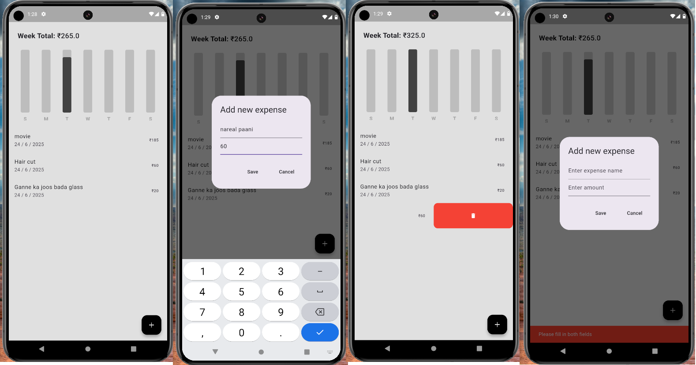

# 💸 Minimal Expense Tracker

A clean and simple Flutter app to track your daily expenses.



## ✨ Features

- Add and delete daily expenses
- View weekly summary with bar chart
- Stores data locally using Hive
- Light and dark mode toggle (optional)
- Minimal UI for distraction-free use

## 📦 Tech Stack

- Flutter
- Hive for local storage
- Provider for state management
- Slidable for swipe-to-delete UI
- Custom Bar Graph for weekly summary

## 🚀 Getting Started

### 1. Clone the repository
```bash
git clone https://github.com/your-username/expense-tracker.git
```

### 2. Install dependencies
```bash
flutter pub get
```

### 3. Run the app
```bash
flutter run
```

## 📁 Folder Structure

```
lib/
├── components/
│   ├── expense_tile.dart
│   └── expense_summary.dart
├── data/
│   └── expense_data.dart
├── models/
│   └── expense_item.dart
├── bar_graph/
│   └── bar_graph.dart
├── datetime/
│   └── date_time_helper.dart
└── main.dart
```

## 📸 Screenshot

The app UI is minimal, with focus on usability and clean visual layout.


## 🧠 Todo (Optional)

- Monthly summary toggle
- Category-based filters
- Export to CSV
- Persistent dark/light mode

## 📜 License

MIT License © [Your Name]
